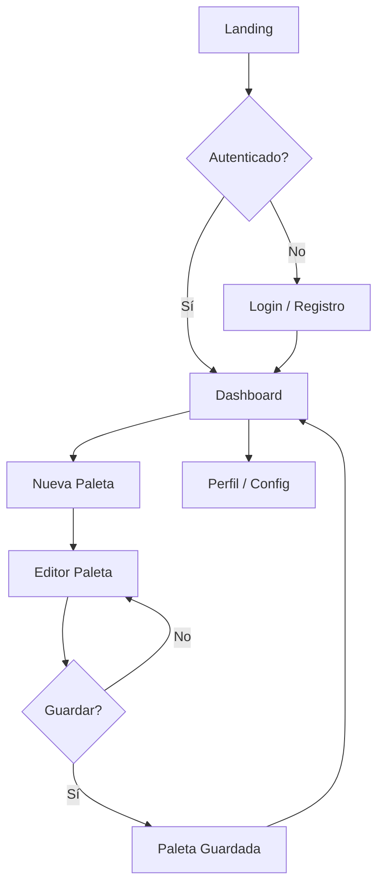

# Skill: UI/UX (Decisiones de Diseño)

## Principio rector

> **`uiux` define el QUÉ y POR QUÉ. `frontend` define el CÓMO.**
> Esta skill **no escribe CSS/JS**. Define tokens, patrones, flujos, reglas de decisión.
> Handoff a `frontend` = especificación clara, comprobable, versionada.

---

## Design Tokens (fuente de verdad única)

### Archivo: `design-tokens.json` (machine-readable)

```json
{
  "version": "1.0.0",
  "color": {
    "background": { "value": "#ffffff", "type": "color" },
    "backgroundSubtle": { "value": "#f8f9fa", "type": "color" },
    "text": { "value": "#1a1a2e", "type": "color" },
    "textMuted": { "value": "#4a4a6a", "type": "color" },
    "primary": { "value": "#2563eb", "type": "color" },
    "primaryHover": { "value": "#1d4ed8", "type": "color" },
    "focus": { "value": "#fbbf24", "type": "color" },
    "error": { "value": "#dc2626", "type": "color" },
    "success": { "value": "#16a34a", "type": "color" }
  },
  "spacing": {
    "1": { "value": "0.25rem", "type": "dimension" },
    "2": { "value": "0.5rem", "type": "dimension" },
    "3": { "value": "1rem", "type": "dimension" },
    "4": { "value": "1.5rem", "type": "dimension" },
    "5": { "value": "2rem", "type": "dimension" },
    "6": { "value": "3rem", "type": "dimension" }
  },
  "typography": {
    "fontFamilySans": { "value": "system-ui, -apple-system, BlinkMacSystemFont, \"Segoe UI\", Roboto, sans-serif", "type": "fontFamily" },
    "fontFamilyMono": { "value": "\"JetBrains Mono\", \"Fira Code\", monospace", "type": "fontFamily" },
    "fontSizeBase": { "value": "1rem", "type": "fontSize" },
    "fontSizeSm": { "value": "0.875rem", "type": "fontSize" },
    "fontSizeLg": { "value": "1.125rem", "type": "fontSize" },
    "fontSizeXl": { "value": "1.5rem", "type": "fontSize" },
    "lineHeightTight": { "value": "1.2", "type": "lineHeight" },
    "lineHeightNormal": { "value": "1.5", "type": "lineHeight" },
    "lineHeightRelaxed": { "value": "1.75", "type": "lineHeight" }
  },
  "borderRadius": {
    "sm": { "value": "0.25rem", "type": "dimension" },
    "md": { "value": "0.5rem", "type": "dimension" },
    "lg": { "value": "1rem", "type": "dimension" }
  },
  "shadow": {
    "sm": { "value": "0 1px 2px rgb(0 0 0 / 0.05)", "type": "shadow" },
    "md": { "value": "0 4px 6px -1px rgb(0 0 0 / 0.1)", "type": "shadow" },
    "lg": { "value": "0 10px 15px -3px rgb(0 0 0 / 0.1)", "type": "shadow" }
  },
  "breakpoints": {
    "tablet": { "value": "40.0625rem", "type": "dimension" },
    "desktop": { "value": "64rem", "type": "dimension" },
    "wide": { "value": "80rem", "type": "dimension" }
  },
  "zIndex": {
    "dropdown": { "value": 100, "type": "number" },
    "sticky": { "value": 200, "type": "number" },
    "modal": { "value": 300, "type": "number" },
    "toast": { "value": 400, "type": "number" },
    "tooltip": { "value": 500, "type": "number" }
  }
}
```

### Generación automática (CI)

```bash
# design-tokens.json → CSS custom properties + TS types + Figma sync
npm run tokens:build
```

**Outputs generados (no se editan a mano):**

- `css/tokens.css` → `--color-primary: #2563eb;`
- `js/tokens.ts` → `export const colorPrimary = "#2563eb";`
- `figma-tokens.json` → import en Figma (plugin Tokens Studio)

---

## Patrones de UI (Component Library)

### Catálogo de patrones (cada uno = decisión documentada)

| Patrón | Qué define | Handoff a frontend |
|--------|------------|-------------------|
| **Button** | Variantes (primary, secondary, ghost, danger), estados, tamaños, loading | Web Component `<ui-button>` + CSS tokens |
| **Input** | Label, helper, error, estados, tipos, validación visual | `<ui-input>` + aria patterns |
| **Dropdown/Select** | Trigger, opciones, agrupación, búsqueda, teclado | `<ui-dropdown>` + focus trap |
| **Modal/Dialog** | Backdrop, focus trap, ESC close, tamaño, stacking | `<ui-dialog>` + `inert` polyfill |
| **Toast/Notification** | Tipos, duración, posicionamiento, stacking, persistencia | `<ui-toast>` + store |
| **Table** | Ordenación, paginación, selección, responsive (stack/collapse) | `<ui-table>` + virtualización opcional |
| **Form Layout** | Grid, agrupación, validación inline, submit states | CSS utilities + JS validation |
| **Navigation** | Header, sidebar, tabs, breadcrumbs, mobile drawer | `<ui-nav>` + responsive breakpoints |
| **Card** | Media, content, actions, hover/focus states, clickable area | `<ui-card>` + container queries |
| **Data Display** | Badges, avatars, progress, skeleton loaders, empty states | Componentes atómicos |

### Documentación por patrón (en `docs/ui-patterns/`)

```markdown
# Patrón: Button

## Cuándo usar
- Acciones primarias (primary)
- Acciones secundarias (secondary)
- Acciones destructivas (danger)
- Enlaces con apariencia botón (ghost)

## Variantes
| Variante | Uso | Contraste mínimo |
|----------|-----|------------------|
| Primary | Acción principal por vista | 7:1 (WCAG AAA) |
| Secondary | Acciones alternativas | 7:1 |
| Danger | Eliminar, irreversible | 7:1 + icono advertencia |
| Ghost | Menos prominente | 4.5:1 (AA) |

## Estados
- Default, Hover, Focus-visible, Active, Disabled, Loading

## Accesibilidad
- `<button>` nativo (no `<div role="button">`)
- `aria-disabled="true"` + `disabled` en loading
- Texto descriptivo (no solo icono sin label)

## Handoff frontend
- Componente: `<ui-button variant="primary" size="md">`
- Tokens: `--color-primary`, `--space-2`, `--radius-md`
- Tests: axe + visual regression
```

---

## Flujos de Usuario (User Flows)

### Formato: Mermaid (versionable, diffable)



### Reglas de flujo

- **Un diagrama por job-to-be-done** principal
- **Estados de error** como nodos explícitos (no "flecha rota")
- **Decisiones** = rombos con condición clara
- **Pantallas** = rectángulos referenciando patrón UI
- **Versionado**: cambia flujo → bump MINOR en `design-tokens.json` + actualizar diagramas

---

## Accesibilidad Semántica (Decisiones, no implementación)

### Reglas de decisión

| Decisión | Regla | Por qué |
|----------|-------|---------|
| **Contraste** | AAA 7:1 **obligatorio** para texto UI; AA 4.5:1 solo para logos/decorativo | Legibilidad universal |
| **Focus order** | DOM order = visual order (salvo skip links) | Predecible para teclado/SR |
| **Heading hierarchy** | h1→h2→h3 sin saltos; uno por página | Navegación SR |
| **Landmarks** | header, nav, main, aside, footer siempre | Orientación SR |
| **Live regions** | `aria-live="polite"` para toasts/validación; `"assertive"` para errores críticos | Anuncio oportuno |
| **Motion** | Animaciones ≤ 200ms; `prefers-reduced-motion` desactiva | Vestibular |
| **Touch targets** | Mínimo 44×44px (WCAG 2.5.5) | Motor fino |
| **Language** | `lang` en html + cambios inline | Pronunciación SR |

---

## Handoff a Frontend (Contrato)

### Entregables por feature

| Entregable | Formato | Quién produce |
|------------|---------|---------------|
| **Design tokens actualizados** | `design-tokens.json` | `uiux` (PR) |
| **Patrones nuevos/actualizados** | `docs/ui-patterns/{pattern}.md` | `uiux` (PR) |
| **Flujos actualizados** | `docs/flows/{flow}.mmd` | `uiux` (PR) |
| **Específica de componente** | Figma link + specs (spacing, states) | `uiux` (Figma) |
| **Implementación** | Web Component + CSS + tests | `frontend` (PR) |
| **Validación a11y** | axe + lighthouse CI | `frontend` (CI) |

### Proceso

1. **`uiux` abre PR** con tokens/patrones/flujos → `frontend` reviewa factibilidad
2. **Acuerdo** → merge a `main` (tokens versionados)
3. **`frontend` implementa** en branch → PR con tests + visual regression
4. **`uiux` valida** en Storybook/preview → aprueba
5. **Merge** → deploy

---

## Design System Versionado

### Versionado tokens (`design-tokens.json`)

| Cambio | Bump | Ejemplo |
|--------|------|---------|
| **PATCH** | Fix token value (typo color), doc only | `#2563eb` → `#2563ec` |
| **MINOR** | Nuevo token, nuevo patrón, flujo extendido | Añadir `--color-warning` |
| **MAJOR** | Rompe contrato (rename token, remove pattern, breaking flow) | `--color-primary` → `--color-brand` |

### Changelog tokens

```markdown
# Design Tokens Changelog

## [1.1.0] - 2025-06-20
### Added
- `--color-warning` + tokens warning para alertas no destructivas
- Patrón `Toast` con variante `warning`

## [1.0.0] - 2025-06-01
### Added
- Tokens base (color, spacing, typography, radius, shadow, z-index)
- Patrones: Button, Input, Dropdown, Modal, Toast, Table, Nav, Card
- Flujos: Auth, Palette Creation, Profile
```

---

## Checklist pre-push (skill-level)

- [ ] `design-tokens.json` válido (schema JSON) + `npm run tokens:build` OK
- [ ] Patrones documentados en `docs/ui-patterns/` (uno por archivo)
- [ ] Flujos en `docs/flows/*.mmd` (Mermaid válido)
- [ ] Contraste AAA verificado para tokens de color (script automatizado)
- [ ] Figma sincronizado con tokens (Tokens Studio plugin)
- [ ] Handoff a `frontend` claro: issues/PRs vinculados
- [ ] Versionado SemVer en `design-tokens.json` + changelog

---

## Integración con `frontend`

> **`frontend` consume `design-tokens.json` como fuente de verdad.**
>
> - `uiux` **propone** → `frontend` **valida factibilidad** → **acuerdan** → versionan
> - **Un PR toca ambos** si hay cambio de tokens/patrones
> - **`frontend` NUNCA inventa tokens** — todos vienen de `design-tokens.json`
> - **`uiux` NUNCA dicta implementación** — solo intención y contratos

---

> **Nota**: Esta skill cubre **decisiones de diseño**. Implementación técnica (CSS, JS, Web Components, build) → `skills/frontend/SKILL.md`.
